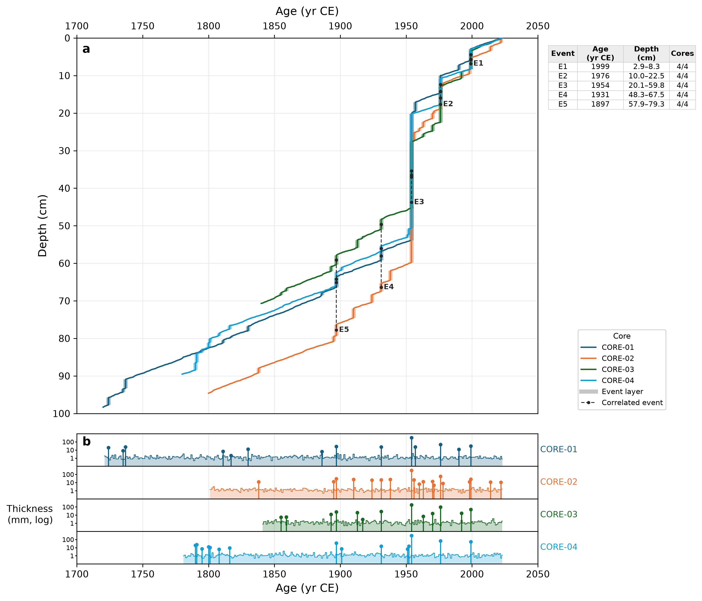
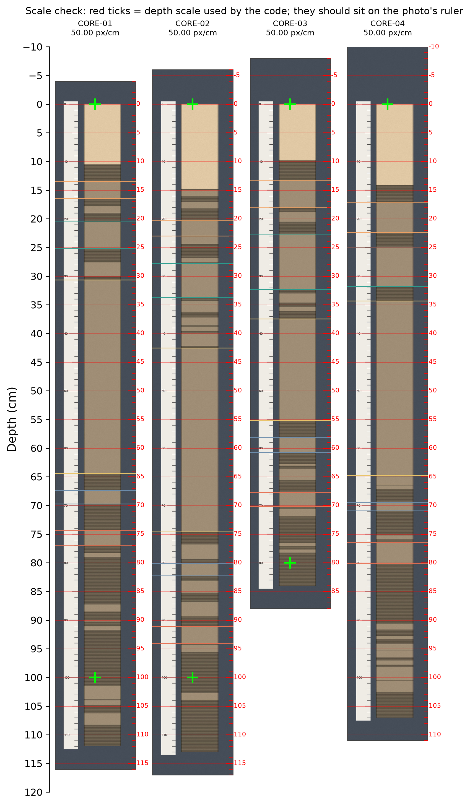
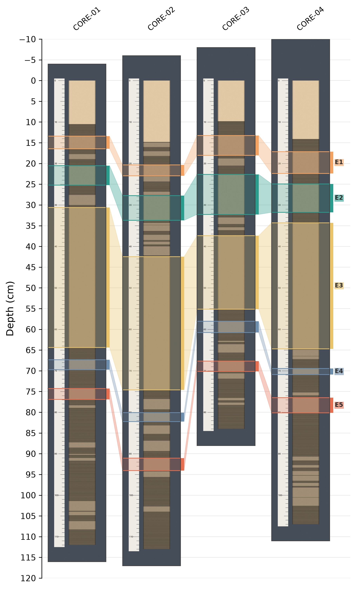

# Varve age-depth model plot

Plots varve-counted age-depth models for several sediment cores as one figure
with linked age and depth scales:

- **a** age-depth model: age (yr CE) vs depth (cm), one line per core. Every
  event layer is drawn as a thick bar on its core's curve. Each event correlated
  between cores (from an **Events** sheet) is shaded as a **coloured column
  hanging from the age axis**: as wide as the event's age range across the
  cores (each layer spanning its varve year, ±0.5 yr), marked by a coloured bar
  on the age scale, with its lower edge running through each core's event base.
  So the column matches both the age and the depth scale. Columns are labelled E1, E2, …, and a
  table beside the plot gives each event's age range, depth range and number of
  cores (event names coloured as in the plot).
- **b** thickness (mm, log) through time, one strip per core, on the same age
  axis as **a**, with event layers as markers and each event's age range shaded
  in the same colour as in **a**

Event layers are read from the counts: when the same year is listed on
consecutive rows with increasing depth, that depth interval is an
instantaneous deposit (e.g. a turbidite) within that year.

## Run in Google Colab

Open `age_depth_colab.ipynb` in Colab (**File → Upload notebook**), then
**Runtime → Run all**. It asks you to upload your `.xlsx` file and downloads the
figure as PNG and PDF.

## Run locally

```bash
pip install pandas numpy matplotlib openpyxl
python plot_age_depth.py my_varve_counts.xlsx -o age_depth_model.pdf --xlim 1700 2050 --ylim 90 0
```

Options:

| Option | Meaning |
|---|---|
| `--depth-col "in core"` | Use a different depth column (default: the one whose header contains "adjusted") |
| `--event-mm 10` | Dashed thickness line on panel b |
| `--events-sheet Events` | Sheet with correlated events (default: a sheet whose name contains "event") |
| `--layout simple` | Age-depth curves only, like the original Excel chart |
| `--sheet Sheet1` | Read only one sheet |

## Workbook layouts

Detected from the header cells (case-insensitive):

| Layout | Columns |
|---|---|
| All cores on one sheet | Row 1: core ID above each block. Row 2: `Year`, `Depth (in core)`, `Depth (adjusted)` |
| One sheet per core (sheet name = core ID) | `Year`, `Depth (cm)` |
| Varve thickness only | `Thickness (mm)`, one row per varve from the top. Pass `--top-year 2023` |

If the same core appears on several sheets, only the first one is used for the
counts. Depths are in cm.

**Correlated events (optional):** a sheet named like `Events`, in the same
layout as the counts, with two rows per event: the event's top and base in every
core (rows 1–2 = E1, rows 3–4 = E2, …). Leave a core's cells blank when the
event is missing from that core. Reading stops at the first fully blank row.

## Example

`make_example_data.py` writes a **synthetic** workbook in the all-cores-on-one-sheet
layout, with an Events sheet, so you can try the script without real core data. `example_age_depth.png`
is the result.



---

# Core photos with event layers (true scale, photos not cropped)

`plot_core_photos.py` uses each core photo **exactly as provided** (nothing is
cropped): the whole image, ruler and background included, is placed on one
shared depth axis (cm) with its own linear depth scale,

    depth = depth at the photo's top edge + pixel position / pixels per cm

The same pixels-per-cm sets the photo's width and the plot uses equal x and y
scales, so each photo keeps its real proportions. Event layers are drawn on that
same depth scale, with a coloured bar beside the core and a shaded band linking
the same event between neighbouring cores. **Event colours are the same as in
the age-depth figure**, so E1, E2, … match between the two figures.

## Depth scale of each photo

Read from the photo itself, in this order:

1. **Two ruler readings** (most accurate): two depths read off the ruler in the
   photo and their pixel positions along the core (the y coordinate for an
   upright photo, x for a sideways one, as any image viewer shows).
2. One ruler reading plus pixels per cm (or the photo's stored DPI).
3. Pixels per cm (or stored DPI) plus the depth at the photo's top edge.
4. The depths at the photo's top and bottom edges.
5. Last resort, marked **APPROXIMATE**: stretched to the deepest counted depth.

Always look at the **scale check** figure (`plot_scale_check`, or `--check`):
it draws the code's depth ticks (every 1 cm, lines every 5 cm) over each full
photo, and they must sit on the photo's own ruler before the events are trusted.

## Run in Google Colab

Open `core_photos_colab.ipynb` in Colab and run the cells in order: upload the
photos and the event file, read two ruler marks per photo (a helper shows each
photo with pixel coordinates), check the scale-check figure, then draw and
download the final figure.

## Inputs

- **Photos** (JPG, PNG, TIFF) as provided. The file name must contain the core ID
  (`GUAC-22A-1G-1.jpg`, `guac_22a_1g_1.tif`, …). Sideways photos are turned
  upright (core top on the left unless `Top side` says otherwise).
- **Photo depth table** (CSV/Excel, optional): `Core` and any of `Ref1 cm`,
  `Ref1 px`, `Ref2 cm`, `Ref2 px`, `Px per cm`, `Top (cm)`, `Bottom (cm)`,
  `Top side`, `File`.
- **Event depths**: the varve workbook's **Events** sheet (`Depth (in core)`
  column by default) or a table `Core, Event, Top (cm), Base (cm)`. Use the same
  depth reference as the photo rulers.

```bash
python plot_core_photos.py --photos photos/*.jpg --photo-depths photo_depths.csv \
    --events Lachua_Varve_counts.xlsx -o core_photos_events.pdf --check scale_check.png
```

## Example

`make_example_photos.py` draws **synthetic** uncropped core photos (background,
ruler, liner; one sideways, one storing its DPI) and their ruler readings.




